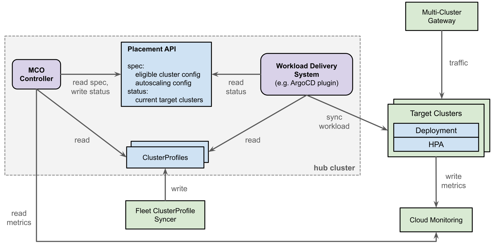
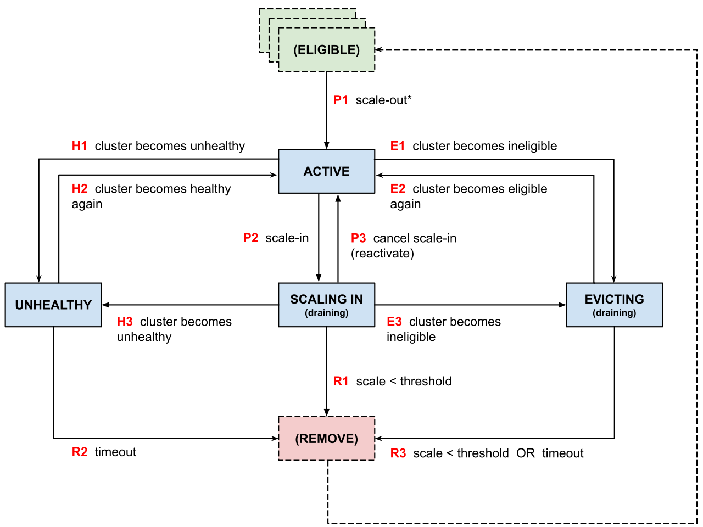

# Overview of Multi-Cluster Orchestrator

Multi-Cluster Orchestrator (MCO) dynamically schedules an application’s
multi-cluster/multi-region deployment, allowing the application to automatically
scale out to more clusters or scale in to fewer clusters as needed.

MCO schedules an application workload onto clusters based on:

*   The preferences specified by the user, such as which clusters are eligible
    to run the workload and which clusters/regions are more desirable to use
*   Information about cluster/region capacity, such as which clusters/regions
    currently have certain machine types available
*   Current load on the application

These scheduling decisions are consumed by the CD tool (a.k.a. workload delivery
system) which provisions the workload onto clusters or removes the workload from
clusters as required.

MCO requires a [hub cluster](https://github.com/kubernetes/community/pull/8210)
which contains metadata about the other clusters in the fleet (in the form of
[ClusterProfile](https://multicluster.sigs.k8s.io/concepts/cluster-profile-api/) resources). The hub cluster is used to run multicluster
controllers that manage the rest of the fleet such as MCO itself or CD tools
such as Argo CD. It is recommended not to run normal application workloads on
the hub cluster.

The application workload is deployed to other clusters in the fleet. MCO can be
used along with a multi-cluster load balancer such as a Google Cloud
[multi-cluster
Gateway](https://cloud.google.com/kubernetes-engine/docs/how-to/deploying-multi-cluster-gateways)
load balancer to dynamically route incoming traffic to the various workload
clusters.

# Architecture

## Design Principles

Other multi-cluster scheduling efforts have tried to do a lot of things all at
once. MCO has intentionally tried to avoid this and instead focuses on solving
the relatively narrow problem of selecting *which* clusters should be running
the workload at a given point in time (including scaling to more/fewer
clusters).

Closely related to this, one of the core design principles of MCO is that the
MCO controller does not interact directly with the clusters that it is managing
except for consuming metrics which they publish. This means that MCO does not
directly provision workloads on clusters or scale the size of the workload on
each cluster.

Instead, the delivery of workloads to clusters is decoupled from the core of
MCO. This allows workload delivery to be pluggable such that it can be
integrated/delegated to existing systems such as Argo CD or Flux (which the user
runs in the same hub cluster as the MCO controller).

Locally scaling the workload within each cluster is left to the standard
Kubernetes [HorizontalPodAutoscaler](https://kubernetes.io/docs/tasks/run-application/horizontal-pod-autoscale/).

## Architecture Diagram

This diagram shows the high-level architecture of Multi-Cluster Orchestrator
when running on Google Cloud. The various components are explained below.



## Placement API

The core of Multi-Cluster Orchestrator is the Placement API. The Placement API
is a CRD which defines a workload to be scheduled and autoscaled onto multiple
clusters.

The spec of the Placement API defines which clusters are eligible to run the
workload and defines the autoscaling parameters for the workload (see below for
more details about autoscaling).

The status of the Placement API contains the set of clusters where the workload
is currently scheduled. This is consumed by the workload delivery system.

Here’s an example of an autoscaling Placement. The clusters that are eligible
to run the workload are defined by the rules section. We start with all of the
clusters for which ClusterProfiles exist, then we filter that using a regex
matching the ClusterProfile’s namespace/name.

```
apiVersion: orchestra.multicluster.x-k8s.io/v1alpha1
kind: MultiKubernetesClusterPlacement
metadata:
  name: cluster-regex-placement
spec:
  rules:
    - type: "all-clusters"
    - type: "cluster-name-regex"
      arguments:
        regex: "^fleet-cluster-inventory/mco-worker-.*"
  scaling:
    autoscaleForCapacity:
      minClustersBelowCapacityCeiling: 1
      workloadDetails:
        namespace: {APP_DEPLOYMENT_NAMESPACE}
        deploymentName: {APP_DEPLOYMENT_NAME}
        hpaName: {APP_HPA_NAME}
```

And here’s another example using a hardcoded list of three eligible clusters on
which the workload will be autoscaled. The workload will be scaled out to the
clusters in the order in which they are specified:

```
apiVersion: orchestra.multicluster.x-k8s.io/v1alpha1
kind: MultiKubernetesClusterPlacement
metadata:
  name: cluster-list-placement
spec:
  rules:
    - type: "cluster-list"
      arguments:
        clusters: "fleet-cluster-inventory/mco-worker-us-west1,fleet-cluster-inventory/mco-worker-us-east1,fleet-cluster-inventory/mco-worker-europe-west4"
  scaling:
    autoscaleForCapacity:
      minClustersBelowCapacityCeiling: 1
      workloadDetails:
        namespace: {APP_DEPLOYMENT_NAMESPACE}
        deploymentName: {APP_DEPLOYMENT_NAME}
        hpaName: {APP_HPA_NAME}
```

## MCO Controller

The MCO controller reads the spec of the Placement, makes decisions about
scheduling and scaling the workload onto clusters, and updates the Placement’s
status. For a given workload, each cluster will transition through the following
state machine:



Initially, we have a set of eligible clusters as defined by the rules in the
Placement. The MCO Controller will start by scaling out the workload to the
first eligible cluster — adding that cluster to the Placement in the ACTIVE
state.

If a current cluster becomes ineligible to run the workload, it transitions to
the EVICTING state and the workload is drained and removed from it.

Part of the MCO Controller is the autoscaler which makes scaling decisions based
on metrics from the clusters (see the Autoscaling section below for details).

If the autoscaler decides that fewer clusters are needed, it moves one of the
ACTIVE clusters into the SCALING_IN state and we start draining the workload
from the cluster. Once the workload gets down to one remaining pod, it is
removed from the cluster entirely.

If the autoscaler decides that more clusters are needed, it first checks if
there is a SCALING_IN cluster available and if so moves it back to ACTIVE.
Otherwise it picks the next eligible cluster and adds it to the set of ACTIVE
clusters.

Health checking is a planned feature but is not currently implemented.

> [!NOTE]
> Proactively draining pods from clusters is coming soon but not currently
> available. This means that clusters will only be removed when they have
> naturally scaled down to very few pods (via their HPAs).

## Workload Delivery

As mentioned above, workload delivery is decoupled from the core MCO Controller
which allows for multiple implementations.

Each implementation should watch the status field of each Placement and ensure
that the workload is provisioned on clusters when they are added to the status
field and removed from clusters when they are removed from the status field.

The only workload delivery system that is currently available is an Argo CD
[ApplicationSet](https://argo-cd.readthedocs.io/en/stable/operator-manual/applicationset/)
[generator](https://argo-cd.readthedocs.io/en/stable/operator-manual/applicationset/Generators/)
[plugin](https://argo-cd.readthedocs.io/en/stable/operator-manual/applicationset/Generators-Plugin/)
which allows users to dynamically target Argo CD Applications to clusters.
Cluster profiles are automatically synced to Argo CD cluster secrets using the
[Argo CD ClusterProfile Syncer](https://github.com/GoogleCloudPlatform/gke-fleet-management/tree/main/argocd-clusterprofile-syncer)

## Cluster Profiles and Syncer

MCO uses
[ClusterProfile](https://github.com/kubernetes/enhancements/blob/master/keps/sig-multicluster/4322-cluster-inventory/README.md)
resources from the [SIG Multicluster](https://multicluster.sigs.k8s.io/)
[Cluster Inventory
API](https://github.com/kubernetes-sigs/cluster-inventory-api?tab=readme-ov-file#cluster-inventory-api)
to represent the clusters within the fleet. When running on Google Cloud,
cluster profiles for all clusters in the fleet can be [automatically generated
in the hub cluster by a syncer running in Google
Cloud](https://cloud.google.com/kubernetes-engine/fleet-management/docs/generate-inventory-for-integrations).
When a cluster is added or removed from the fleet, the list of cluster profiles
is updated automatically by the syncer.

Using the syncer is optional; the cluster profiles could also be created and
managed manually.

# Autoscaling

The autoscaler is part of the MCO Controller.

**In the current implementation, the autoscaler tries to maintain a target
number of clusters which are below their capacity ceiling — i.e. clusters on
which more pods can still be scheduled.** This will likely evolve in the future
to be more flexible/sophisticated.

Metrics published by each cluster are used to determine which clusters are
currently at their capacity ceiling. To accomplish this, it uses the following
query logic:

1.  Check if the cluster is at its capacity ceiling due to the current nodes
    being at capacity and the cluster-autoscaler being unable to obtain more
    nodes.

    To check this, we check whether: a) there are pending pods for the workload
    and b) there have been `FailedScaleUp` events from the cluster-autoscaler (the
    latter requires creating and using a log-based metric).

2.  Check if the workload’s HorizontalPodAutoscaler is unable to scale up
    further due to reaching its configured maximum number of replicas.

    To check this, we check if a) the HPA’s number of replicas is equal to it’s
    configured maximum and b) whether HPA’s ScalingLimited condition is true.

When the number of clusters below their capacity ceiling falls below the target,
the workload is scaled out to a new cluster.

Currently there are several limitations related to the autoscaling:

*   The queries are hardcoded and the Placement contains parameters which are
    used in the queries such as the name and namespace of the Deployment for the
    workload. The queries will be made user-configurable soon.
*   Scaling in is currently implemented in a very naive way. Scaling in a
    cluster is only triggered when the cluster’s HPA wants to scale the workload
    down further than is possible due to the HPA’s configured minimum number of
    replicas. This means that in practice clusters won’t be scaled in until
    there are very few pods remaining. We plan to improve scale-in soon to make
    it more responsive.
*   The hardcoded queries currently require the user to set up a Google Cloud
    log-based metric with a specific name and definition. Here’s an example of
    how to set up the log-based metric with the gcloud CLI:

```
cat > /tmp/metric_definition.yaml << EOF
filter: jsonPayload.reason=FailedScaleUp AND jsonPayload.reportingComponent=cluster-autoscaler
labelExtractors:
  cluster: EXTRACT(resource.labels.cluster_name)
  location: EXTRACT(resource.labels.location)
  namespace_name: EXTRACT(resource.labels.namespace_name)
  pod_name: EXTRACT(resource.labels.pod_name)
  project_id: EXTRACT(resource.labels.project_id)
metricDescriptor:
  displayName: metric reflecting occurences of FailedScaleUp
  labels:
  - key: project_id
  - key: pod_name
  - key: namespace_name
  - key: cluster
  - key: location
  metricKind: DELTA
  type: logging.googleapis.com/user/ClusterAutoscalerFailedScaleUp
  unit: '1'
  valueType: INT64
EOF

gcloud logging metrics create ClusterAutoscalerFailedScaleUp \
  --config-from-file=/tmp/metric_definition.yaml
```
