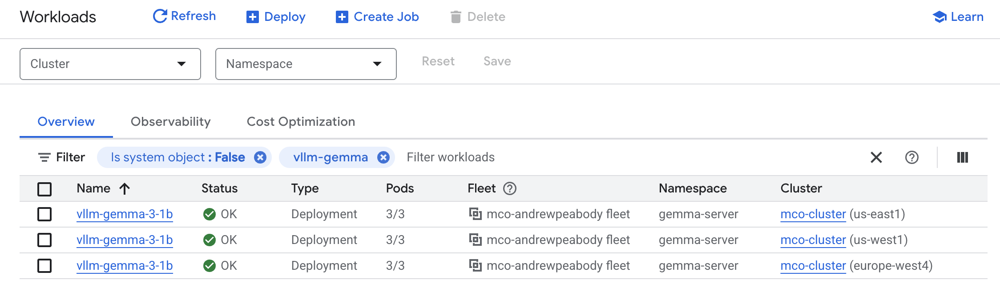

# Gemma 3 vLLM Sample

In this quickstart, you learn how to deploy the Gemma 3 vLLM inference sample
application as a multi-region [Google Kubernetes Engine (GKE)][0] workload using
[Multi-cluster Orchestrator][18] and [Multi-cluster Gateway][19].

The high demand for GPUs across the industry can sometimes lead to shortages in
public cloud regions. Multi-Cluster Orchestrator can help mitigate these stock
out scenarios by automatically scaling workloads to clusters in different
regions with available GPU resources, and scaling them back when appropriate.
This sample also incorporates the new
[`gke-l7-cross-regional-internal-managed-mc`](https://cloud.google.com/kubernetes-engine/docs/how-to/deploying-multi-cluster-gateways#cross-region-ilb)
 GatewayClass to provide internal Layer 7 load balancing across GKE clusters in
 multiple regions, providing private access to the LLM workload.

Infrastructure as Code (IaC) is a practice of managing and provisioning software
infrastructure resources using code. Terraform is a popular open source IaC tool
that supports a wide range of Cloud services, including GKE. As a GKE platform
administrator, you can use Terraform to standardize configuration of your
Kubernetes clusters and streamline your DevOps workflows. To learn more, see
[Terraform support for GKE][1].

## Objectives

- Deploy the pre-requisite infrastructure, including:
  - Hub GKE cluster running Multi-cluster Orchestrator and Argo CD
  - Worker GKE clusters in multiple-regions
- Deploy the Gemma 3 vLLM sample workload using Multi-cluster Orchestrator and
  Argo CD
- Load test the Gemma using Multi-cluster Gateway to trigger
  multi-cluster scaling

## Before you begin

1. In the Google Cloud console, on the project selector page, select or
  [create a Google Cloud project][2].

1. [Make sure that billing is enabled for your Google Cloud project][3].

1. The following service APIs will be enabled:
   1. Cloud Resource Manager
   1. Compute Engine
   1. Google Kubernetes Engine
   1. GKE Hub
   1. Connect Gateway
   1. Monitoring
   1. Traffic Director
   1. Multi-cluster Ingress
   1. Multi-cluster Service Discovery

1. In addition to the `Owner` role, your account will need the Service Account
  Token Creator role (`roles/iam.serviceAccountTokenCreator`).

1. Ensure your project has sufficient quota for L4 GPUs. For more information,
  see [About GPUs](https://cloud.google.com/kubernetes-engine/docs/concepts/gpus#gpu-quota)
  and [Allocation quotas](https://cloud.google.com/compute/resource-usage#gpu_quota).

1. Create a [Hugging Face](https://huggingface.co/) account, if you don't already have one.

1. [Get access to the Gemma model](https://cloud.google.com/kubernetes-engine/docs/tutorials/serve-gemma-gpu-vllm#model-access)

1. You should be familiar with the basics of Terraform. You can use the following
resources:
   - [Getting Started with Terraform][5] (video)
   - [Terraform commands][6]

## Prepare the environment

In this tutorial, you should use [Cloud Shell][7] to manage resources
hosted on Google Cloud. Cloud Shell is preinstalled with the software you need
for this tutorial, including [Terraform][8], [kubectl][9], and [gcloud CLI][10].

> [!IMPORTANT]
> If you do not use Cloud Shell, you may need to install
> Terraform, kubectl, and gcloud CLI. You must also set your default
> Terraform project with: `export GOOGLE_CLOUD_PROJECT=PROJECT_ID`.

1. Launch a Cloud Shell session from the Google Cloud console, by clicking Cloud
Shell activation icon Activate Cloud Shell in the Google Cloud console. This
launches a session in the bottom pane of the Google Cloud console.

The service credentials associated with this virtual machine are automatic, so
you do not have to set up or download a service account key.

2. Before you run commands, set your default [project][11] in the Google Cloud CLI
  using the following command:

```sh
gcloud config set project PROJECT_ID
```

3. Clone the GitHub repository:

```sh
git clone https://github.com/GoogleCloudPlatform/gke-fleet-management.git --single-branch
```

4. Change to the Gemma vLLM sample directory:

```sh
cd gke-fleet-management/multi-cluster-orchestrator/samples/gemma_vllm
```

## Deploy Infrastructure

This is the Platform Administrator step.

1. In Cloud Shell, run this command to verify that Terraform is available:

```sh
terraform version
```

The output should be similar to the following:

```sh
Terraform v1.10.5
on linux_amd64
```

2. Change Directory:

```sh
cd 1-infrastructure
```

3. Review the following Terraform file:

```sh
cat main.tf
```

The file describes the following resources:
  - Service accounts
  - IAM permissions
  - GKE hub cluster
  - GKE worker clusters
  - Custom Metrics Stackdriver Adapter
  - Argo CD
  - Multi-cluster Orchestrator
  - MCO generator plugin for Argo CD
  - Argo CD ClusterProfile Syncer

4. Initialize Terraform:

```sh
terraform init
```

5. Apply the Terraform configuration:

```sh
terraform apply
```

Review the plan and when prompted, enter `yes`, to confirm actions.

This command may take around 20 minutes to complete.

The output is similar to the following:

```sh
Apply complete! Resources: 53 added, 0 changed, 0 destroyed.

Outputs:

argocd = <<EOT

In order to access the server UI you have the following options:

1. kubectl port-forward service/argocd-server -n argocd 8080:443

    and then open the browser on http://localhost:8080 and accept the certificate

2. enable ingress in the values file `server.ingress.enabled` and either
      - Add the annotation for ssl passthrough: https://argo-cd.readthedocs.io/en/stable/operator-manual/ingress/#option-1-ssl-passthrough
      - Set the `configs.params."server.insecure"` in the values file and terminate SSL at your ingress: https://argo-cd.readthedocs.io/en/stable/operator-manual/ingress/#option-2-multiple-ingress-objects-and-hosts


After reaching the UI the first time you can login with username: admin and the random password generated during the installation. You can find the password by running:

kubectl -n argocd get secret argocd-initial-admin-secret -o jsonpath="{.data.password}" | base64 -d

(You should delete the initial secret afterwards as suggested by the Getting Started Guide: https://argo-cd.readthedocs.io/en/stable/getting_started/#4-login-using-the-cli)

EOT
```

## Deploy Application

This is the Application Operator step.

1. Change Directory:

```sh
cd ../2-workload
```

2. The application can be instantiated using **either** the (recommended) **A. Kubectl** or the **B. Terraform with Helm** section:

### A. Kubectl

1. Obtain hub cluster credentials:

```sh
gcloud container clusters get-credentials mco-hub --region us-central1
```

2. Create `gemma-server` namespace:

```sh
kubectl create namespace gemma-server
```

3. Create `network.yaml` file with the following contents:
```yaml
kind: GCPBackendPolicy
apiVersion: networking.gke.io/v1
metadata:
  name: gemma-server-policy
  namespace: gemma-server
spec:
  targetRef:
    group: net.gke.io
    kind: ServiceImport
    name: gemma-server-service
  default:
    timeoutSec: 100
    scopes:
    - selector:
        gke.io/region: europe-west4
      backendPreference: PREFERRED
    maxRatePerEndpoint: 10
---
apiVersion: networking.gke.io/v1
kind: HealthCheckPolicy
metadata:
  name: gemma-server-healthcheck
  namespace: gemma-server
spec:
  default:
    checkIntervalSec: 15
    healthyThreshold: 10
    unhealthyThreshold: 1
    config:
      httpHealthCheck:
        port: 8000
        portSpecification: USE_FIXED_PORT
        requestPath: /health
      type: HTTP
  targetRef:
    group: net.gke.io
    kind: ServiceImport
    name: gemma-server-service
---
apiVersion: gateway.networking.k8s.io/v1
kind: Gateway
metadata:
  name: gemma-server-gateway
  namespace: gemma-server
spec:
  gatewayClassName: gke-l7-cross-regional-internal-managed-mc
  addresses:
  - type: networking.gke.io/ephemeral-ipv4-address/us-central1
    value: us-central1
  listeners:
  - name: http
    port: 80
    protocol: HTTP
    allowedRoutes:
      kinds:
      - kind: HTTPRoute
---
apiVersion: gateway.networking.k8s.io/v1
kind: HTTPRoute
metadata:
  name: gemma-server-route
  namespace: gemma-server
  labels:
    gateway: gemma-server-gateway
spec:
  parentRefs:
  - kind: Gateway
    name: gemma-server-gateway
  rules:
  - backendRefs:
    - group: net.gke.io
      kind: ServiceImport
      name: gemma-server-service
      port: 8000
```

This creates the cross-region internal Application Load Balancer with an
ephemeral IP address in us-central1, sets `europe-west4` as it's prefered
region, and imports the `gemma-server-service` service for the backend.

Apply with:

```sh
kubectl apply -f network.yaml
```

4. Create `placement.yaml` file with the following contents:
```yaml
apiVersion: orchestra.multicluster.x-k8s.io/v1alpha1
kind: MultiKubernetesClusterPlacement
metadata:
  name: gemma-vllm-placement-autoscale
  namespace: gemma-server
spec:
  affinity:
    clusterAffinity:
      requiredDuringSchedulingRequiredDuringExecution:
        clusterSelectorTerms:
        - matchExpressions:
          - labelSelector:
              key: environment
              operator: In
              values:
              - production
  scaling:
    autoscaleForCapacity:
      minClustersBelowCapacityCeiling: 1
      workloadDetails:
        namespace: gemma-server
        deploymentName: vllm-gemma-3-1b
        hpaName: gemma-server-autoscale
```

This creates the Multi-Cluster Orchestrator placement for the Gemma vLLM
application, using a regex to specify the eligible clusters in the fleet.

Apply with:

```sh
kubectl apply -f placement.yaml
```

5. Create `applicationset.yaml` file with the following contents:

**Replace `REPLACE_WITH_YOUR_HF_TOKEN` with your Hugging Face API token.**

```yaml
apiVersion: argoproj.io/v1alpha1
kind: ApplicationSet
metadata:
  name: gemma-vllm-applicationset
  namespace: argocd
spec:
  goTemplate: true
  generators:
    - plugin:
        configMapRef:
          name: argocd-mco-placement
        input:
          parameters:
            multiClusterOrchestraPlacementName: "gemma-vllm-placement-autoscale"
            multiClusterOrchestraPlacementNamespace: "gemma-server"
        requeueAfterSeconds: 10
  syncPolicy:
    applicationsSync: sync
    preserveResourcesOnDeletion: false
  template:
    metadata:
      name: "{{.name}}-gs"
    spec:
      destination:
        namespace: gemma-server
        name: "{{.name}}"
      syncPolicy:
        automated: {}
        syncOptions:
          - CreateNamespace=true
      project: default
      source:
        path: fleet-charts/gemma-server
        repoURL: https://github.com/GoogleCloudPlatform/gke-fleet-management.git
        targetRevision: HEAD
  templatePatch: |
    spec:
      source:
        helm:
          parameters:
            - name: hf_api_token
              value: "REPLACE_WITH_YOUR_HF_TOKEN"
```

This defines the Argo CD Application Set which will be deployed to the fleet
clusters selected by Multi-Cluster Orchestrator.

> [!IMPORTANT]
> Without a valid Hugging Face API token with access to the Gemma model, the
> deployment will enter a crash loop state.

Apply with:

```sh
kubectl apply -f applicationset.yaml
```

### B. Terraform with Helm

> [!IMPORTANT]
> Skip this section if you followed the above **Kubectl** section.

1. Review the following Terraform file:

```sh
cat main.tf
```

The file describes the following resources:

- A [Helm][15] chart for Gemma 3 vLLM [Argo CD][14] ApplicationSet

3. Hugging Face API Token

Edit `main.tf` and set `hf_api_token` your Hugging Face API token.

```
  hf_api_token = "REPLACE_WITH_YOUR_HF_API_TOKEN"
```

> [!IMPORTANT]
> Without a valid Hugging Face API token with access to the Gemma model, the
> deployment will enter a crash loop state.

2. Initialize Terraform:

```sh
terraform init
```

3. Apply the Terraform configuration:

```sh
terraform apply
```

When prompted, enter `yes` to confirm actions.

This command may take a minute to complete.

The output is similar to the following:

```sh
Apply complete! Resources: 1 added, 0 changed, 0 destroyed.
```

## Verify the application is working

Do the following to confirm the Gemma 3 vLLM server is running correctly:

1. Obtain hub cluster credentials:

```sh
gcloud container clusters get-credentials mco-hub --region us-central1
```

2. Review the Multi-cluster Orchestrator Placement:

```sh
kubectl describe MultiKubernetesClusterPlacement gemma-vllm-placement-autoscale -n gemma-server
```

The response should be similar to:

```bash
Name:         gemma-vllm-placement-autoscale
Namespace:    gemma-server
Labels:       app.kubernetes.io/managed-by=Helm
Annotations:  meta.helm.sh/release-name: gemma-vllm-application
              meta.helm.sh/release-namespace: gemma-server
API Version:  orchestra.multicluster.x-k8s.io/v1alpha1
Kind:         MultiKubernetesClusterPlacement
Spec:
  Affinity:
    Cluster Affinity:
      Required During Scheduling Required During Execution:
        Cluster Selector Terms:
          Match Expressions:
            Label Selector:
              Key:       environment
              Operator:  In
              Values:
                production
  Scaling:
    Autoscale For Capacity:
      Min Clusters Below Capacity Ceiling:  1
      Use Draining:                         true
      Workload Details:
        Deployment Name:  vllm-gemma-3-1b
        Hpa Name:         gemma-server-autoscale
        Namespace:        gemma-server
Status:
  Clusters:
    Last Transition Time:
    Name:                  mco-cluster-europe-west4
    Namespace:             fleet-cluster-inventory
    State:                 ACTIVE
  Last Addition Time:
Events:                    <none>
```

In this example the application was initially deployed to the `mco-cluster-europe-west4` cluster.

3. Review the application status:

```sh
kubectl get application -n argocd
```

The response should be similar to:

```sh
NAME                                                  SYNC STATUS   HEALTH STATUS
fleet-cluster-inventory.mco-cluster-europe-west4-gs   Synced        Healthy
```

> [!TIP]
> If the application isn't yet synced and healthy, wait a few minutes and
> retry the step.

4. Retrieve the Gateway address:

```sh
kubectl get gateway gemma-server-gateway -n gemma-server -o jsonpath="{.status.addresses[0].value}"
```

> [!IMPORTANT]
> If there is no IP address, retry the retrieval step after a few minutes.

5. Create a bastion host on the project’s default network.

6. Connect to the bastion host:

```sh
gcloud compute ssh BASTION_NAME
```

7. Export the retrieved Gateway address:

```sh
GATEWAY_ENDPOINT={YOUR GATEWAY ADDRESS}
```

8. Use `curl` to chat with the model:

```sh
curl http://${GATEWAY_ENDPOINT}/v1/chat/completions -X POST -H "Content-Type: application/json" -d '{
    "model": "google/gemma-3-1b-it",
    "messages": [
        {
          "role": "user",
          "content": "Why is the sky blue?"
        }
    ]
}'
```

> [!TIP]
> It could take up to 10 minutes for the service to be ready for use.

## Scale the workload across clusters

Do the following to generate load:

1. Create `loadtest.js` file with the following contents:

```js
import http from 'k6/http';

export const options = {
  discardResponseBodies: true,

  scenarios: {
    // Baseline load
    baseline: {
      executor: 'constant-arrival-rate',
      rate: 1,
      timeUnit: '1s',
      duration: '45m',
      preAllocatedVUs: 5,
      maxVUs: 150,
    },

    // Test load
    test: {
      executor: 'ramping-arrival-rate',
      stages: [
        // Baseline only
        { target: 0, duration: '1m' },
        // Ramp load up
        { target: 45, duration: '5m' },
        { target: 90, duration: '22m' },
      ],
      preAllocatedVUs: 1000,
      maxVUs: 10000,
    },
  },
};

export default function () {
  const url = `http://${__ENV.GATEWAY_ENDPOINT}/v1/chat/completions`;
  const payload = JSON.stringify({
    "model": "google/gemma-3-1b-it",
    "messages": [
        {
          "role": "user",
          "content": "Why is the sky blue?"
        }
    ]
  });

  const params = {
    headers: {
      'Content-Type': 'application/json',
    },

    timeout: '120s'
  };

  http.post(url, payload, params);
}
```

2. Install `k6` on the bastion host:

```sh
sudo apt update; sudo apt install snapd; sudo snap install snapd; sudo snap install k6
```

3. Use `k6` to generate load:

```sh
k6 run -e GATEWAY_ENDPOINT=${GATEWAY_ENDPOINT} loadtest.js
```

4. Go to the [GKE Workloads][16] page in the Google Cloud Console:



5. Observe over 25 minutes as the `vllm-gemma-3-1b` deployment scales to the
  maxReplica limit on the first cluster, and then is deployed to the 2nd and
  then eventually the 3rd cluster.

6. (Optional) You can also monitor the cluster deployments in Argo CD:


The Terraform output from the Deploy Infrastructure steps detail how to access Argo CD on your cluster.

7. The surge load will terminate after ~28 minutes. Continue to observe as the
  workload scales back down into a single cluster.

## Clean up

To avoid incurring charges to your Google Cloud account for the resources used
on this quickstart, follow these steps.

  1. Run the following command first in `2-workload` and then after ~10 minutes in
  `1-infrastructure` to delete the Terraform resources:

```sh
terraform destroy --auto-approve
```

## What's next

* Examine the contents of `2-workload/charts/gemma-vllm-application` to observe
how to structure your own application.

[0]: https://cloud.google.com/kubernetes-engine
[1]: https://cloud.google.com/kubernetes-engine/docs/resources/use-terraform-gke
[2]: https://cloud.google.com/resource-manager/docs/creating-managing-projects
[3]: https://cloud.google.com/billing/docs/how-to/verify-billing-enabled#console
[5]: https://www.youtube.com/watch?v=BUPenAjobjw
[6]: https://cloud.google.com/docs/terraform/basic-commands
[7]: https://cloud.google.com/shell
[8]: https://cloud.google.com/docs/terraform/get-started-with-terraform
[9]: https://kubernetes.io/docs/reference/kubectl/
[10]: https://cloud.google.com/sdk/gcloud
[11]: https://support.google.com/cloud/answer/6158840
[12]: https://registry.terraform.io/providers/hashicorp/google/latest/docs
[14]: https://argo-cd.readthedocs.io/
[15]: https://helm.sh/
[16]: https://console.cloud.google.com/kubernetes/workload/overview
[18]: ../../README.md
[19]: https://cloud.google.com/kubernetes-engine/docs/how-to/deploying-multi-cluster-gateways
