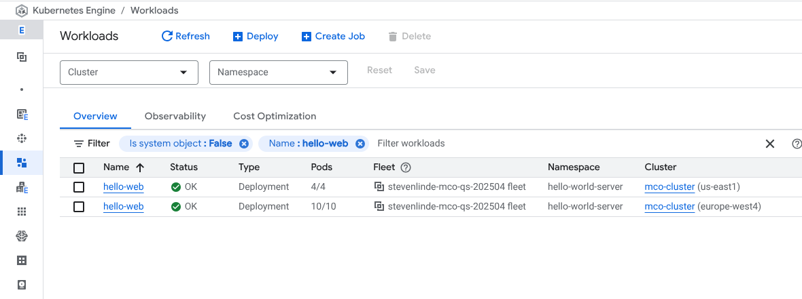
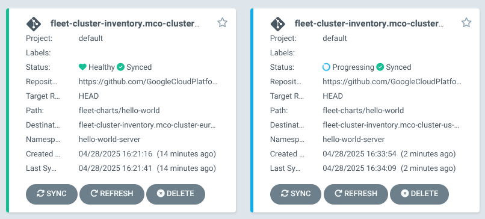

# Hello World Sample

In this quickstart, you learn how to deploy a Hello World sample application as a
multi-region [Google Kubernetes Engine (GKE)][0] workload using
[Multi-cluster Orchestrator][18] and [Multi-cluster Gateway][19].

Infrastructure as Code (IaC) is a practice of managing and provisioning software
infrastructure resources using code. Terraform is a popular open source IaC tool
that supports a wide range of Cloud services, including GKE. As a GKE platform
administrator, you can use Terraform to standardize configuration of your
Kubernetes clusters and streamline your DevOps workflows. To learn more, see
[Terraform support for GKE][1].

## Objectives

- Deploy the pre-requisite infrastructure, including:
  - Hub GKE cluster running Multi-cluster Orchestrator and Argo CD
  - Worker GKE clusters in multiple-regions
- Deploy the Hello World sample workload using Multi-cluster Orchestrator and
  Argo CD
- Load test the Hello World server using Multi-cluster Gateway to trigger
  multi-cluster scaling

## Before you begin

1. In the Google Cloud console, on the project selector page, select or
[create a Google Cloud project][2].

1. [Make sure that billing is enabled for your Google Cloud project][3].

1. The following service APIs will be enabled:
   1. Compute Engine
   1. Google Kubernetes Engine
   1. GKE Hub
   1. Connect Gateway
   1. Monitoring
   1. Traffic Director
   1. Multi-cluster Ingress
   1. Multi-cluster Service Discovery

1. In addition to the `Owner` role, your account will need the Service Account
  Token Creator role (`roles/iam.serviceAccountTokenCreator`).

1. You should be familiar with the basics of Terraform. You can use the following
resources:

- [Getting Started with Terraform][5] (video)
- [Terraform commands][6]

## Prepare the environment

In this tutorial, you should use [Cloud Shell][7] to manage resources
hosted on Google Cloud. Cloud Shell is preinstalled with the software you need
for this tutorial, including [Terraform][8], [kubectl][9], and [gcloud CLI][10].

> [!NOTE]
> If you do not use Cloud Shell, you may need to install K6 or Docker,
> Terraform, kubectl, and gcloud CLI. You must also set your default
> Terraform project with: `export GOOGLE_CLOUD_PROJECT=PROJECT_ID`.

1. Launch a Cloud Shell session from the Google Cloud console, by clicking Cloud
Shell activation icon Activate Cloud Shell in the Google Cloud console. This
launches a session in the bottom pane of the Google Cloud console.

The service credentials associated with this virtual machine are automatic, so
you do not have to set up or download a service account key.

2. Before you run commands, set your default [project][11] in the Google Cloud CLI
  using the following command:

```
gcloud config set project PROJECT_ID
```

3. Clone the GitHub repository:

```
git clone https://github.com/GoogleCloudPlatform/gke-fleet-management.git --single-branch
```

4. Change to the Hello World sample directory:

```
cd gke-fleet-management/multi-cluster-orchestrator/samples/hello_world
```

## Review the Terraform file

The [Google Cloud Platform Provider][12] is a plugin that lets you
manage and provision Google Cloud resources using Terraform, HashiCorp's
Infrastructure as Code (IaC) tool. The Google Cloud Platform Provider serves as a
bridge between Terraform configurations and the Google Cloud APIs, letting you
define infrastructure resources, such as virtual machines and networks, in a
declarative manner.

1. Review the following Terraform file:

```
cat 1-infrastructure/main.tf
```

This is the Platform Administrator step, and the file describes the following resources:

  - Service accounts
  - IAM permissions
  - GKE hub cluster
  - GKE worker clusters
  - Argo CD
  - Multi-cluster Orchestrator
  - MCO generator plugin for Argo CD
  - Argo CD ClusterProfile Syncer

2. Review the following Terraform file:

```
cat 2-workload/main.tf
```

This is the Application Operator step, and the file describes the following resources:

- A [Helm][15] chart for Hello World [Argo CD][14] ApplicationSet

## Deploy Infrastructure

1. In Cloud Shell, run this command to verify that Terraform is available:

```
terraform version
```

The output should be similar to the following:

```
Terraform v1.10.5
on linux_amd64
```

2. Change Directory:

```
cd 1-infrastructure
```

3. Initialize Terraform:

```
terraform init
```

4. Apply the Terraform configuration:

```
terraform apply
```

Review the plan and when prompted, enter `yes`, to confirm actions.

This command may take around 20 minutes to complete.

The output is similar to the following:

```
Apply complete! Resources: 26 added, 0 changed, 0 destroyed.

Outputs:

argocd = <<EOT

In order to access the server UI you have the following options:

1. kubectl port-forward service/argocd-server -n argocd 8080:443

    and then open the browser on http://localhost:8080 and accept the certificate

2. enable ingress in the values file `server.ingress.enabled` and either
      - Add the annotation for ssl passthrough: https://argo-cd.readthedocs.io/en/stable/operator-manual/ingress/#option-1-ssl-passthrough
      - Set the `configs.params."server.insecure"` in the values file and terminate SSL at your ingress: https://argo-cd.readthedocs.io/en/stable/operator-manual/ingress/#option-2-multiple-ingress-objects-and-hosts


After reaching the UI the first time you can login with username: admin and the random password generated during the installation. You can find the password by running:

kubectl -n argocd get secret argocd-initial-admin-secret -o jsonpath="{.data.password}" | base64 -d

(You should delete the initial secret afterwards as suggested by the Getting Started Guide: https://argo-cd.readthedocs.io/en/stable/getting_started/#4-login-using-the-cli)

EOT
```

## Deploy Application

1. Change Directory:

```
cd ../2-workload
```

2. Initialize Terraform:

```
terraform init
```

3. Apply the Terraform configuration:

```
terraform apply
```

When prompted, enter `yes` to confirm actions.

This command may take a minute to complete.

The output is similar to the following:

```
Apply complete! Resources: 1 added, 0 changed, 0 destroyed.
```

## Verify the application is working

Do the following to confirm the Hello World server is running correctly:

1. Obtain hub cluster credentials:

```
gcloud container clusters get-credentials mco-hub --region us-central1
```

2. Review the Multi-cluster Orchestrator Placement:

```
kubectl describe MultiKubernetesClusterPlacement hello-web-placement-autoscale -n hello-world-server
```

The response should be similar to:

```
Name:         hello-web-placement-autoscale
Namespace:    hello-world-server
Labels:       app.kubernetes.io/managed-by=Helm
Annotations:  meta.helm.sh/release-name: hello-world-application
              meta.helm.sh/release-namespace: hello-world-server
API Version:  orchestra.multicluster.x-k8s.io/v1alpha1
Kind:         MultiKubernetesClusterPlacement
Spec:
  Rules:
    Type:  all-clusters
    Arguments:
      Regex:  ^fleet-cluster-inventory/mco-cluster-
    Type:     cluster-name-regex
  Scaling:
    Autoscale For Capacity:
      Min Clusters Below Capacity Ceiling:  1
      Workload Details:
        Deployment Name:  hello-web
        Hpa Name:         hello-web-autoscale
        Namespace:        hello-world-server
Status:
  Clusters:
    Last Transition Time:
    Name:                  mco-cluster-europe-west4
    Namespace:             fleet-cluster-inventory
    State:                 ACTIVE
  Last Addition Time:
Events:                    <none>
```

In this example the application was initially deployed to the `mco-cluster-europe-west4` cluster.

3. Review the application status:

```
kubectl get application -n argocd
```

The response should be similar to:

```
NAME                                                  SYNC STATUS   HEALTH STATUS
fleet-cluster-inventory.mco-cluster-europe-west4-hw   Synced        Healthy
```

> [!TIP]
> If the application isn't yet synced and healthy, wait a few minutes and
> retry the step.

4. Retrieve the Gateway address:

```
GATEWAY_ENDPOINT=`kubectl get gateway hello-web-gateway -n hello-world-server -o jsonpath="{.status.addresses[0].value}"`
```

5. View the Gateway address:

```
echo $GATEWAY_ENDPOINT
```

> [!IMPORTANT]
> If there is no IP address, retry the retrieval step after a few minutes.

6. Use `curl`:

```
curl $GATEWAY_ENDPOINT/index.html
```

The response should be similar to:

```
Hello, world!
Version: 1.0.0
Hostname: hello-web-7949f9559b-c7xwh
```

> [!TIP]
> If the service isn't ready, retry after a few minutes.

## Scale the workload across clusters

Do the following to generate load:

1. Create `loadtest.js` file with the following contents:

```
import http from 'k6/http';

export const options = {
  discardResponseBodies: true,

  scenarios: {
    test: {
      executor: 'constant-arrival-rate',
      rate: 7500,
      timeUnit: '1s',
      duration: '30m',
      preAllocatedVUs: 1500,
      maxVUs: 10000,
    },
  },
};

export default function () {
  const url = `http://${__ENV.GATEWAY_ENDPOINT}/index.html`;

  const params = {
    timeout: '120s'
  };

  http.get(url, params);
}
```

2. Use `k6` to generate load:

```
go install go.k6.io/k6@latest
k6 run -e GATEWAY_ENDPOINT=${GATEWAY_ENDPOINT} loadtest.js
```

> [!TIP]
> If you are using Cloud Shell or have Docker installed, you can alternatively
> use the `k6` Docker image by running:
> `docker run --rm -i grafana/k6:latest run -e GATEWAY_ENDPOINT=${GATEWAY_ENDPOINT} - <loadtest.js`

3. Go to the [GKE Workloads][16] page in the Google Cloud Console:



4. Observe over 20-25 minutes as the `hello-web` deployment scales to the
  maxReplica limit on the first cluster, and then is deployed to the 2nd and
  then eventually the 3rd cluster.

5. (Optional) You can also monitor the cluster deployments in Argo CD:



The Terraform output from the Deploy Infrastructure steps detail how to access Argo CD on your cluster.

6. The surge load will terminate after 30 minutes. Continue to observe as the
  workload scales back down into a single cluster over ~20 minutes.

## Clean up

To avoid incurring charges to your Google Cloud account for the resources used
on this quickstart, follow these steps.

  1. Run the following command first in `2-workload` and then after ~10 minutes in
  `1-infrastructure` to delete the Terraform resources:

```
terraform destroy --auto-approve
```

## What's next

* Examine the contents of `2-workload/charts/hello-world-application` to observe
how to structure your own application.

[0]: https://cloud.google.com/kubernetes-engine
[1]: https://cloud.google.com/kubernetes-engine/docs/resources/use-terraform-gke
[2]: https://cloud.google.com/resource-manager/docs/creating-managing-projects
[3]: https://cloud.google.com/billing/docs/how-to/verify-billing-enabled#console
[5]: https://www.youtube.com/watch?v=BUPenAjobjw
[6]: https://cloud.google.com/docs/terraform/basic-commands
[7]: https://cloud.google.com/shell
[8]: https://cloud.google.com/docs/terraform/get-started-with-terraform
[9]: https://kubernetes.io/docs/reference/kubectl/
[10]: https://cloud.google.com/sdk/gcloud
[11]: https://support.google.com/cloud/answer/6158840
[12]: https://registry.terraform.io/providers/hashicorp/google/latest/docs
[14]: https://argo-cd.readthedocs.io/
[15]: https://helm.sh/
[16]: https://console.cloud.google.com/kubernetes/workload/overview
[18]: ../../README.md
[19]: https://cloud.google.com/kubernetes-engine/docs/how-to/deploying-multi-cluster-gateways